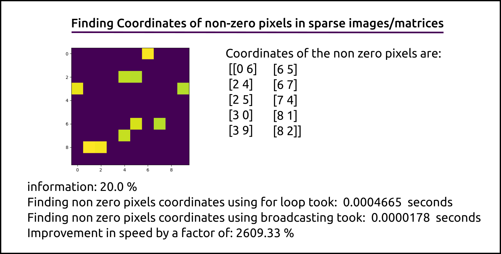
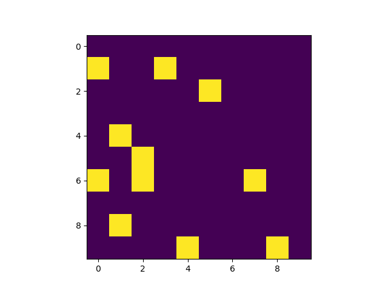
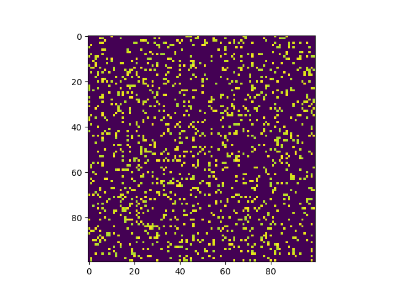
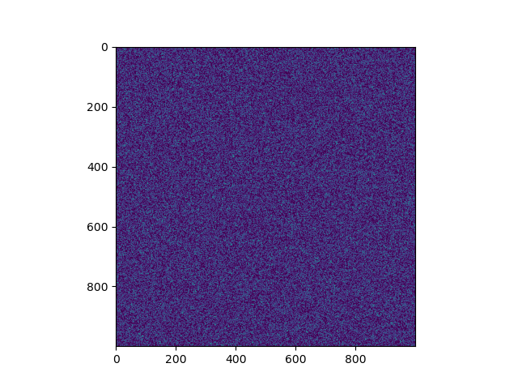

Sparse images/matrices are those in which the contained useful information is less compared to total space being occupied. 

To begin with, we will look at an example image/matrix, the output we need and the main take aways from this post.



__Task:__ To determine the (row, column) values of all the non zero pixels in a matrix or an image. Typical example
would be text in a image. If you are familiar with the well known MNIST Handwritten digits dataset, that could be 
another good example of a sparse image



### Example images that we will be working with
***






We will be going through two approaches in this short tutorial and also see how the methods compare in execution time

**Method 1:** The traditional and the first approach that comes to mind through _for loops_ 

**Method 2:** We can leverage the broadcasting properties of numpy and find a work around to reach the same result

### Libraries used
***
* matplotlib
* time
* numpy

### Pre Prep
***
First we need to create a sparse image to work with
```python
import time
import numpy as np
import matplotlib.pyplot as plt

# Image height and width dimensions
rows = 100
columns = 100
img = np.random.rand(rows, columns) # Drawing number from uniform distribution [0,1] to avoid negative values
img = img * 255

img[img < 220] = 0 # this is optional and can be skipped to handle any threshold other than 'non zero value' & 'zero'
img = img.astype(np.uint8)
print(f"sparsity: {len(img[img != 0]) * 100 / np.cumproduct(img.shape)[-1]} %")
```
### Method 1
***
```python
x_coords = np.array([]) # To store column values
y_coords = np.array([]) # To store row values
start = time.time()
for r in range(rows):
    for c in range(columns):
        if img[r][c] != 0:
            x_coords = np.concatenate((x_coords, np.array([c])))
            y_coords = np.concatenate((y_coords, np.array([r])))
x_coords = x_coords.reshape(-1, 1)
y_coords = y_coords.reshape(-1, 1)
coords = np.hstack((y_coords, x_coords))
print("Finding non zero pixels coordinates with for loops took: ", time.time() - start, " seconds")
```

### Method 2
***
First we create a template to go with our image dimension and make a boolean mask which we use to find the 
non zero pixel coordinates
```python
coordinates_grid = np.ones((2, rows, columns), dtype=np.int16)
coordinates_grid[0] = coordinates_grid[0] * np.array([range(rows)]).T
coordinates_grid[1] = coordinates_grid[1] * np.array([range(rows)])

start = time.time()
mask = img != 0
non_zero_coords = np.hstack((coordinates_grid[0][mask].reshape(-1, 1),
                             coordinates_grid[1][mask].reshape(-1, 1)))
print("Finding non zero pixels coordinates using broadcasting took: ", time.time() - start, " seconds")
# print("Coordinates of the non zero pixels are:\n", non_zero_coords)
plt.imshow(img)
plt.show()
```

### Results
***
```shell
sai@sai:~/****/scripts$ python coordinates.py 10 10
information: 13.0 %
Finding non zero pixels coordinates with for loops took:  0.0003330707550048828  seconds
Finding non zero pixels coordinates using broadcasting took:  3.4809112548828125e-05  seconds

sai@sai:~/****/scripts$ python coordinates.py 100 100
information: 13.43 %
Finding non zero pixels coordinates with for loops took:  0.024660587310791016  seconds
Finding non zero pixels coordinates using broadcasting took:  0.00010442733764648438  seconds

sai@sai:~/****/scripts$ python coordinates.py 1000 1000
information: 13.7047 %
Finding non zero pixels coordinates with for loops took:  8.874347448348999  seconds
Finding non zero pixels coordinates using broadcasting took:  0.007306575775146484  seconds
```

### Conclusions
***
It is clear that the execution times differ significantly and the benefits of vectorization becomes more dominant as the input data grows.
